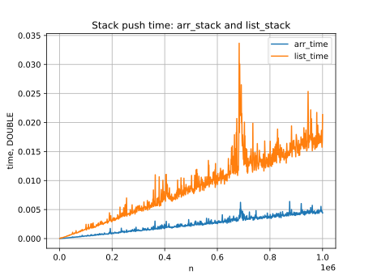

# Lab 1. List and array stack comparison

Tests in one serie - **5**.
Data type for tests - **int**.


## Stacks realisation

Array stack - default (with shrink).
List stack - default.


## Test 1

Push \(10^6\) integers, then remove half of the elements and push a quarter of the original amount back — 750000 integers will remain. Repeat removing half and inserting a quarter until fewer than 100000 elements remain in the stack (this results in 9 iterations).

## Test 2

Push \(10^6\) integers, then 100 times remove 10000 elements and add the same number back. After that, as in the first test, perform 9 delete-insert iterations, and then again 100 times remove 10000 elements and add the same number back.

## Test 3

Figure out how to generate random numbers from the set {1, 2}. Then first grow the stack to one million elements, and after that perform one million instructions of the following kind: whenever 1 appears, add an element; whenever 2 appears, pop an element from the stack. Measure the time only after the stack size has reached one million.

## Test 4

Graphs \(time(n)\) on a single figure, where \(n\) is the number of push operations for the array-based stack and the linked-list-based stack. Iterate \(n\) from 1000 to \(10^6\) with a step of 1000.


## Results

```Test 1 arr  stack time: 0.017109
Test 1 list stack time: 0.061004

Test 2 arr  stack time: 0.049498
Test 2 list stack time: 0.158738

Test 3 arr  stack time: 0.058943
Test 3 list stack time: 0.176708
```




## Conclusion

We can see that the dynamic array stack is faster in all tests. Therefore, it's better than the list stack. I suppose that speed difference lies here: first of all it is easier for a program to read inline memory (dynamic array), secondly list stac spend a lot of time for numerous callocs.