# Сравнение сортировок

## Пункт 0

### Проделанная работа
Были реализованы:
- генератор тестов случайных массивов неотрицательных 32-битных чисел;
- программа для сортировки через библиотечный `qsort`;
- скрипты для генерации тестов и ответов;
- инфраструктура тестирования сортировок через `testing.h`.

### Результат
Сгенерированы наборы тестов:
- `tests/small_tests`
- `tests/big_tests`
- `tests/test_most_dublicates`


---

## Пункт 1

### Проделанная работа
Были реализованы:
- сортировка вставками;
- сортировка пузырьком;
- сортировка выбором;
- сортировка Шелла.

Все сортировки тестировались на `tests/small_tests`.

### Результат
График:
- `plots/plot_point1.svg`

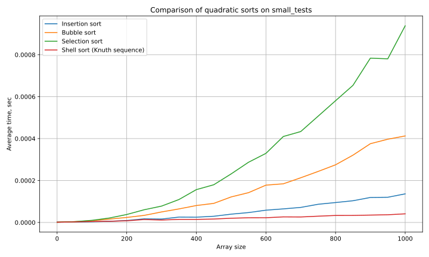

Ответ на вопрос:
- Какая сортировка показала себя лучше всех остальных?  
  Сортировка Шелла.
- Почему?

  Она заранее уменьшает число дальних инверсий большими шагами, а затем завершает сортировку на почти упорядоченном массиве.

---

## Пункт 2

### Проделанная работа
Была реализована bottom-up версия `k`-ичной heapsort для `k = 2..10`.

Сравнение проводилось на `tests/big_tests`.

### Результат
График:
- `plots/plot_point2.svg`

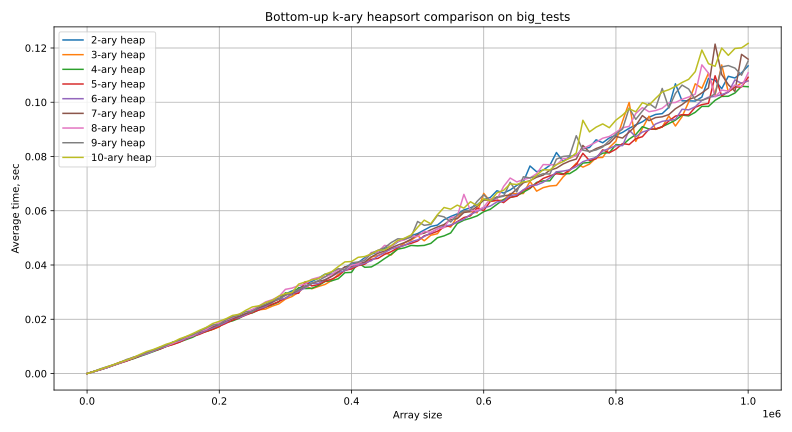


Ответ на вопрос:
- Какое `k` оказалось оптимальным?  

  k = 4.
- Почему?

  При увеличении `k` уменьшается высота кучи, но возрастает цена поиска максимального ребёнка.

---

## Пункт 3

### Проделанная работа
Были реализованы:
- рекурсивная mergesort;
- итеративная mergesort.

Сравнение проводилось на `tests/big_tests`.

### Результат
График:
- `plots/plot_point3.svg`

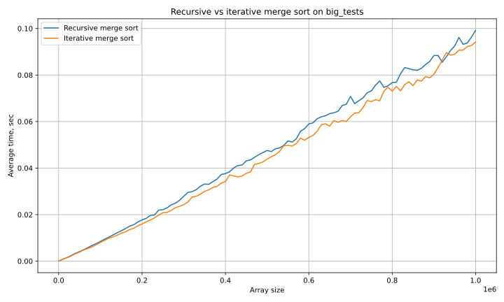


Ответы на вопросы:
- Какой вариант работает лучше?  
  Итеративный.
- Почему?  
  Скорее всего, из-за меньших накладных расходов на рекурсивные вызовы и более прямолинейной структуры проходов по массиву.

---

## Пункт 4

### Проделанная работа
Были реализованы quicksort с тремя видами разбиения:
- Ломуто;
- Хоара;
- Толстое разбиение.

Также были реализованы оптимизации:
- рекурсия только в меньшую часть;
- рекурсия в меньшую часть + сортировка малых блоков.

### Результат
Графики:
- `plots/plot_point4_big.svg`
- `plots/plot_point4_duplicates.svg`
- `plots/plot_point4_optimizations.svg`

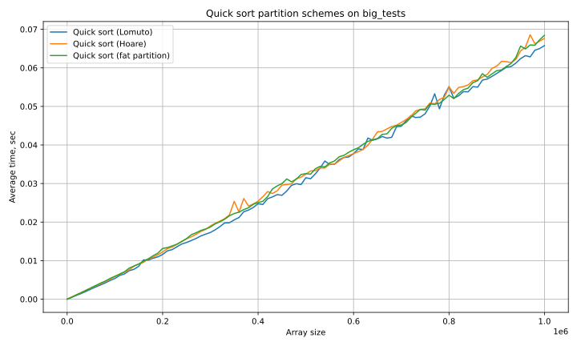
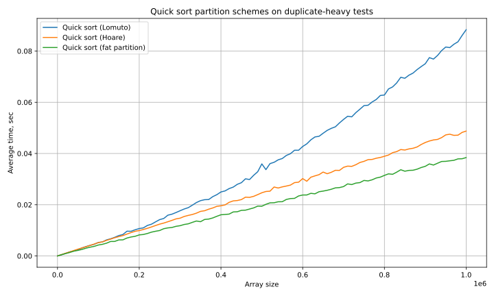
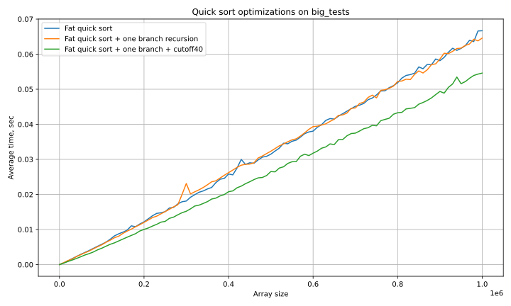

Ответы на вопросы:
- Что работает лучше на обычных тестах?  
  Толстое разбиение с оптимизациями.
  
- Что работает лучше на тестах с большим количеством дубликатов?  
  Толстое разбиение.

- Что дают оптимизации?  
  Рекурсия только в меньшую часть уменьшает глубину стека, а сортировка малых блоков отдельным алгоритмом уменьшает накладные расходы на коротких отрезках.
- Почему?  
  Толстое разбиение особенно эффективно при большом числе одинаковых элементов, а оптимизации уменьшают константы и делают quicksort более устойчивым.

Лучшая версия: **fat quick sort + one branch + cutoff40**.

---

## Пункт 5

### Проделанная работа
Для лучшей quicksort из пункта 4 были сравнены стратегии выбора pivot:
- центральный элемент;
- медиана трёх;
- случайный элемент;
- медиана трёх случайных;
- медиана медиан.

### Результат
График:
- `plots/plot_point5.svg`

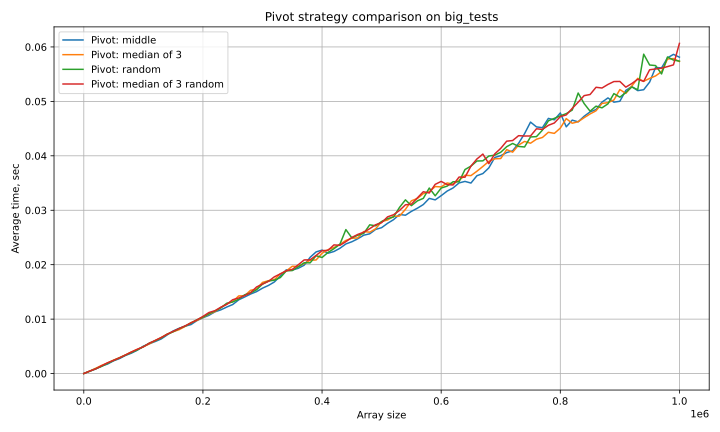

Лучшая стратегия выбора pivot: median of 3.

Ответы на вопросы:
- Что работает лучше?  
  Медиана трёх.

- Почему?  

  Компромисс между качеством pivot и стоимостью его выбора.

- Для каких стратегий можно придумать killer-массивы?  

  Для центрального элемента и медианы трёх.

- Какую стратегию всё же выбрать?
  Медиана трёх, она показала лучший результат.

---

## Пункт 6

### Проделанная работа
Для лучшей quicksort был исследован выбор размера малого блока `t`, при котором сортировка переключается на сортировку Шелла.

### Результат
График:
- `plots/plot_point6.svg`

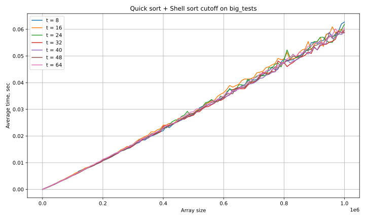

Ответы на вопросы:
- Какой размер оптимален для блока?  
  t = 32.
- Почему?  

  При меньших значениях quicksort слишком долго работает на блоках, а при больших Shell sort начинает получать слишком длинные блоки.

---

## Пункт 7

### Проделанная работа
Был реализован introsort, который использует:
- quicksort как основной алгоритм;
- heapsort при слишком большой глубине рекурсии;
- сортировку Шелла на малых блоках.

Дополнительно был подобран коэффициент `C` в ограничении глубины `C log n`.

### Результат
Графики:
- `plots/plot_point7_c.svg`
- `plots/plot_point7_final.svg`

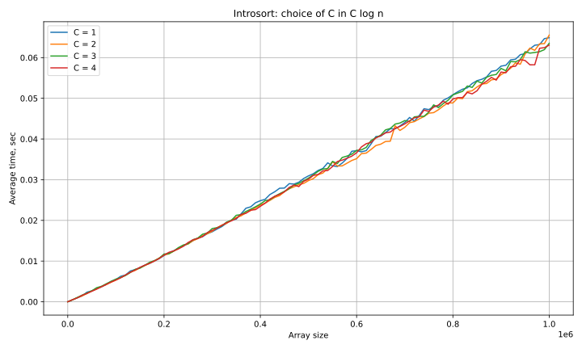
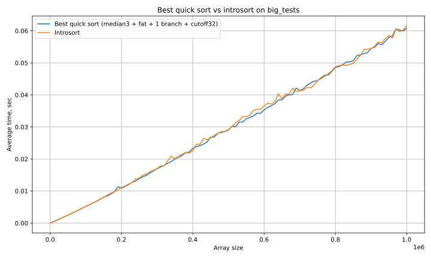

Оптимальный коэффициент `C`: 2 - из графика.

Ответы на вопросы:
- Стало ли работать лучше?  
  Да

- Почему?  

  При опасном росте глубины рекурсии алгоритм переходит на heapsort, избегая ухудшения работы.

---

## Пункт 8

### Проделанная работа
К сравнению были добавлены готовые реализации:
- `TimSort`
- `PDQSort`

Использованные репозитории:
- `orlp/pdqsort`
- `timsort/cpp-TimSort`

### Результат
График:
- `plots/plot_point8.svg`

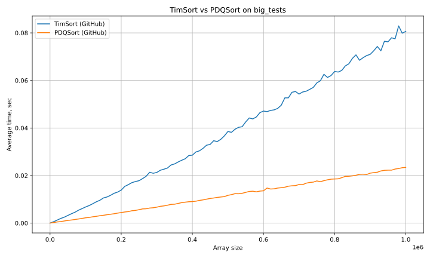

Ответы на вопросы:
- Какая из двух реализаций оказалась быстрее?  
  PDQSort.

- Какие выводы можно сделать по сравнению `TimSort` и `PDQSort`?  
  На случайных числовых массивах PDQSort оказался лучше, что согласуется с тем, что он специально оптимизирован под быструю сортировку общих массивов. TimSort обычно особенно силён на частично упорядоченных данных.

---

## Пункт 9

### Проделанная работа
Были реализованы:
- LSD radix sort по байтам;
- MSD radix sort по байтам.

Сравнение проводилось на `tests/big_tests`.

### Результат
График:
- `plots/plot_point9.svg`

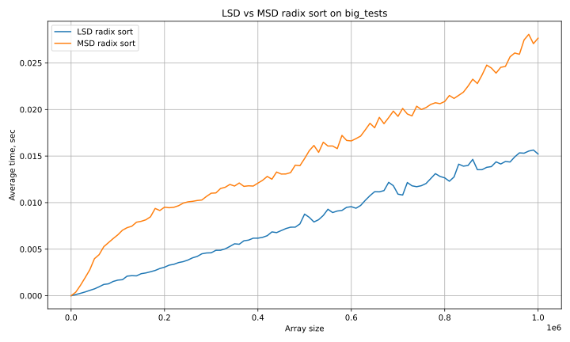

Ответ на вопрос:
- Какая работает лучше?  
  LSD radix sort.

  Для чисел фиксированной длины она стабильнее.

---

## Пункт 10

### Проделанная работа
Был построен итоговый график, на котором сравниваются:
- лучшие сортировки из всех пунктов;
- библиотечный `qsort`.

Для `qsort` отдельно были собраны данные на `tests/big_tests`.

### Результат
График:
- `plots/plot_point10.svg`

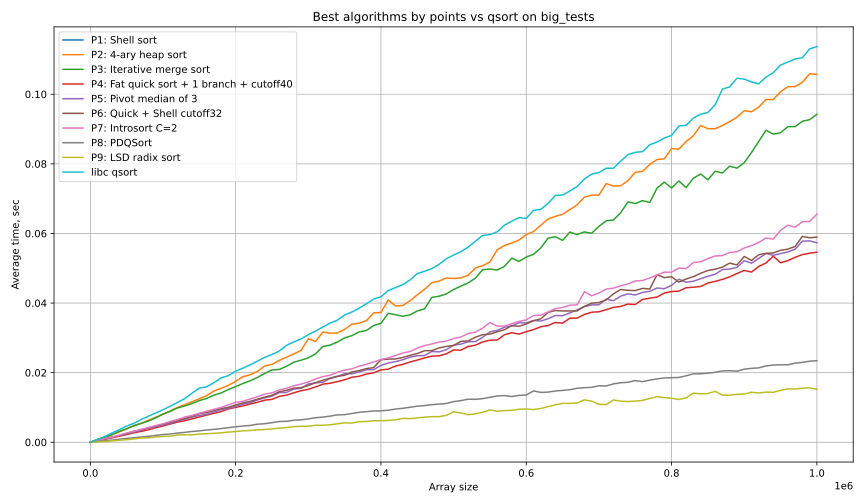

`Pn` - Plot n (Сделано скорее для выравнивания с qsort-ом).


### Выводы
Ответы на вопросы:
- Удалось ли догнать стандартный `qsort` или хотя бы приблизиться к нему?  
  Да, даже обогнать.
  `qsort` оказался одним из самых медленных алгоритмов в сравнении.

- Какие алгоритмы показали лучшие результаты в исследовании?  
  Лучший результат - `LSD radix sort`.  
  Второе место - `PDQSort`.  
  Третье -  `fat quick sort + 1 branch + cutoff40`.

- Какие общие выводы можно сделать по результатам исследования?  
  Хорошая сортировка должна работать поэтапно - по-разному на разных размерах данных, входящих во входной массив.

- На каком CPU выполнялись тесты?  
  AMD ryzen 7 5800h


## Запуск

```./scripts/run_all_tests.sh```


