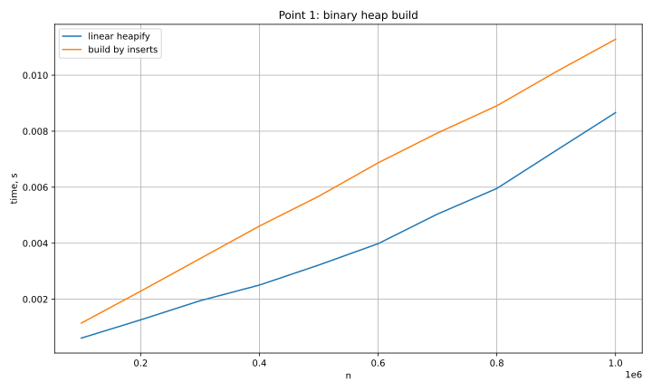
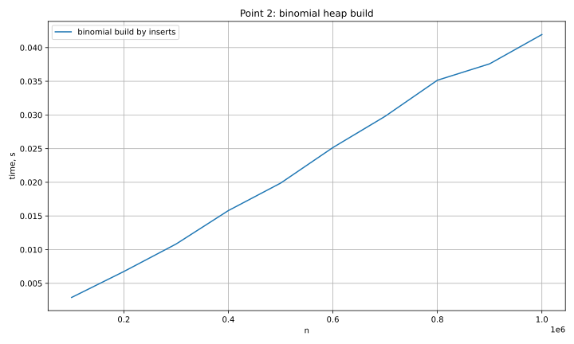
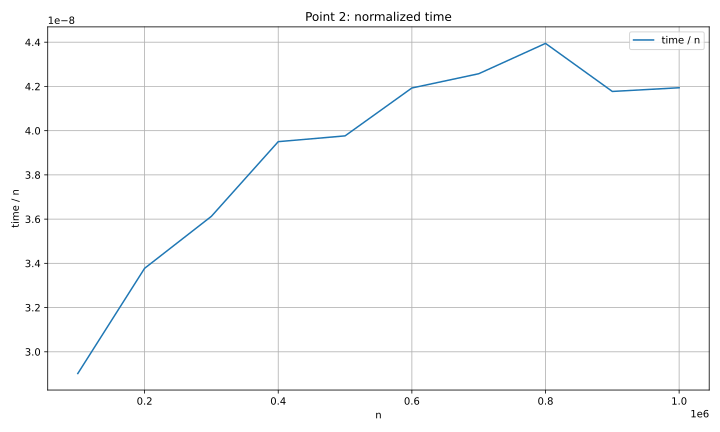
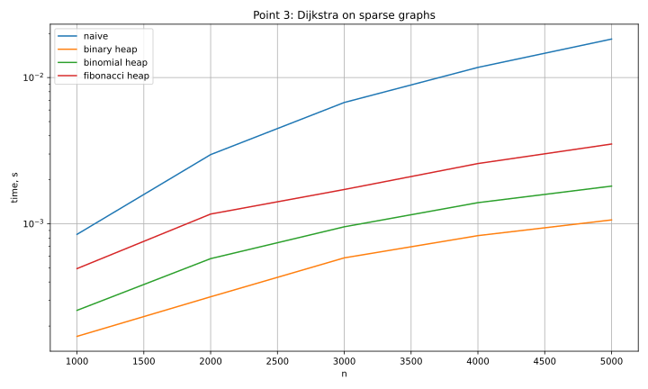
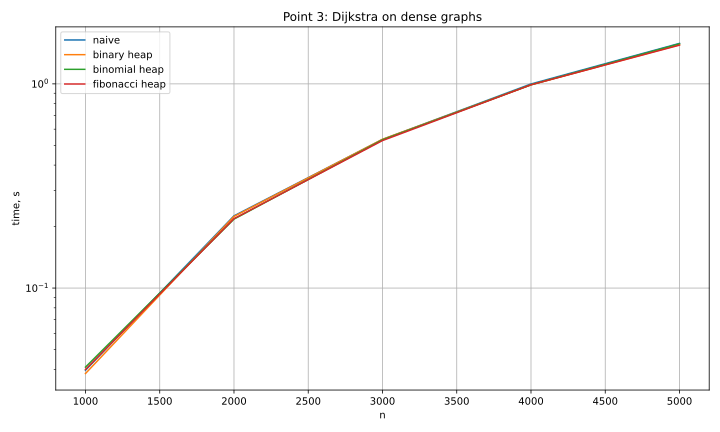

# Лабораторная работа 4. Кучи

## Пункт 1. Построение бинарной кучи

### Проделанная работа

Бинарная куча строилась 2 способами **in place** на одном и том же массиве:

- линейное построение снизу вверх;
- построение последовательными вставками.

Для каждого размера от `100000` до `1000000` с шагом `100000` сохранялось среднее время по 5 измерениям.  

### График



### Ответы на вопросы

**Насколько выигрывает линейный алгоритм?**  
Линейный алгоритм выигрывает у построения вставками примерно на `15%`.

**Почему так происходит?**  
Линейное построение - `O(n)`,
Построение вставками - `O(n log n)`.


---

## Пункт 2. Построение биномиальной кучи

### Проделанная работа

Биномиальная куча для каждого размера от `100000` до `1000000` с шагом `100000` строилась последовательными вставками элементов. Сохранялось среднее время по 5 измерениям. 

### Графики





### Ответы на вопросы

**Получился ли график линейным?**  
Визуально близок.

**Почему так происходит?**  
Теоретическая оценка времени построения биномиальной кучи последовательными вставками равна `O(n log n)`. Это можно доказать построив второй график.

**Что видно по второму графику?**  
На графике `T(n) / n` видно медленное возрастание - логарифм.

---

## Пункт 3. Дейкстра с разными кучами

### Проделанная работа

4 варианта алгоритма Дейкстры:

- наивный;
- с бинарной кучей;
- с биномиальной кучей;
- с фибоначчиевой кучей.


Тестирование проводилось на двух типах графов:

- разреженные графы;
- плотные графы.

Для каждого графа сравнивались времена работы всех четырёх реализаций.  
Корректность проверялась сравнением массивов расстояний с наивной реализацией.

### Графики





### Ответы на вопросы

**Что получилось на разреженных графах?**  
Лучшую эффективность показала бинарная куча.

**Почему так происходит?**    
Бинарная куча выигрывает за счёт хорошей асимптотики и малых констант накладных расходов.

**Что получилось на плотных графах?**  
Различий между реализациями почти нет.

**Почему так происходит?**  
При большом числе рёбер основное время начинает тратиться на обработку самого графа.

---

## Вывод

Лучшая с теоретической точки зрения структура данных не всегда оказывается лучшей на практике.

---

## Запуск

```bash
./scripts/run_all.sh
```