# Хеширование

## Пункт 1. Исследование хеш-функций

### Проделанная работа

Исследованы хеш-функции для `unsigned int`, `float` и строк.  
Тесты - `1 000 000` случайных ключей с `srand(42)`.

#### `unsigned int`

**Время работы**
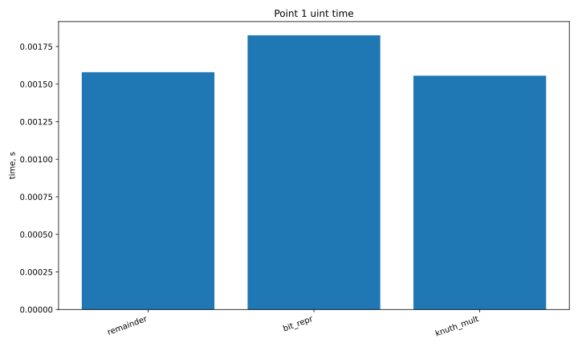

**Дисперсия**
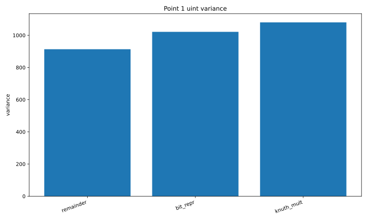

**Остаток от деления**


**Битовое представление**
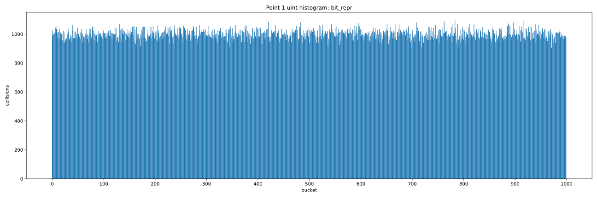

**Метод умножения Кнута**
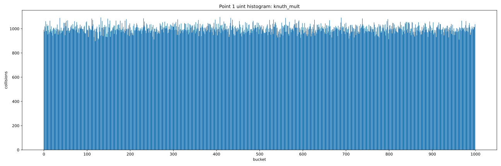

#### `float`

**Время работы**
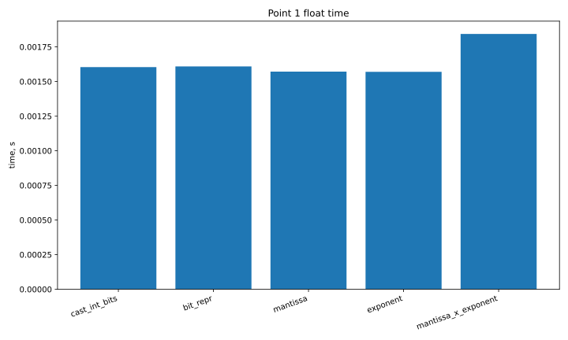

**Дисперсия**
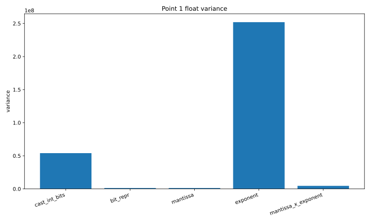

**Извлечение мантиссы**
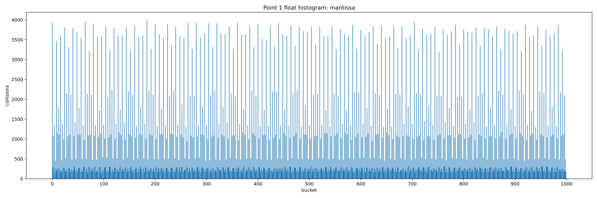

**Произведение мантиссы на экспоненту**
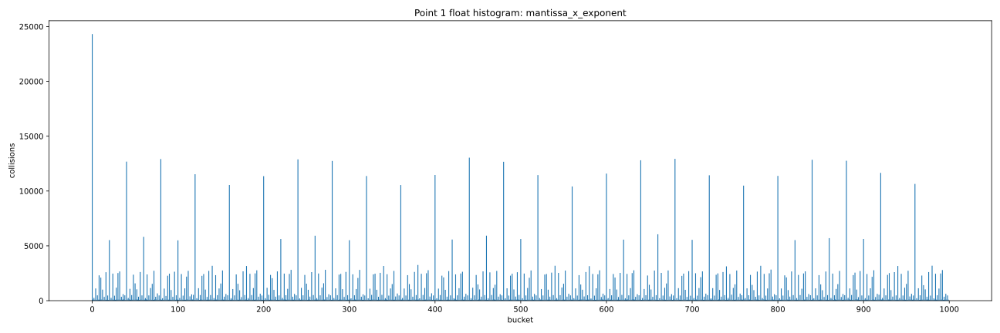

#### `string`

**Время работы**
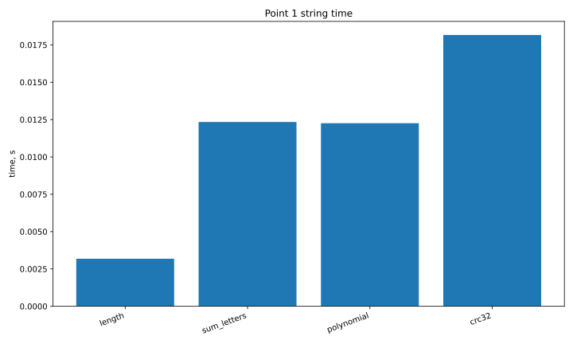

**Дисперсия**
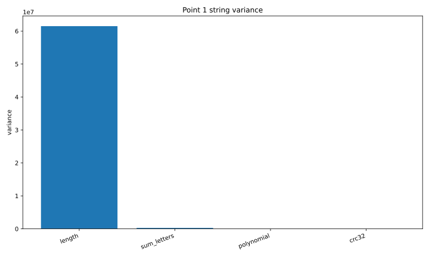

**Длина строки**
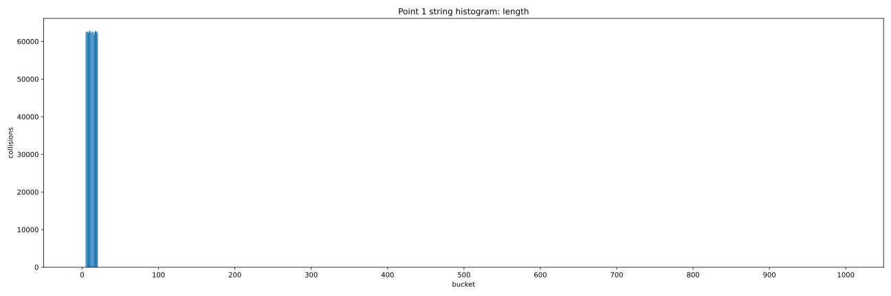

**Сумма букв**
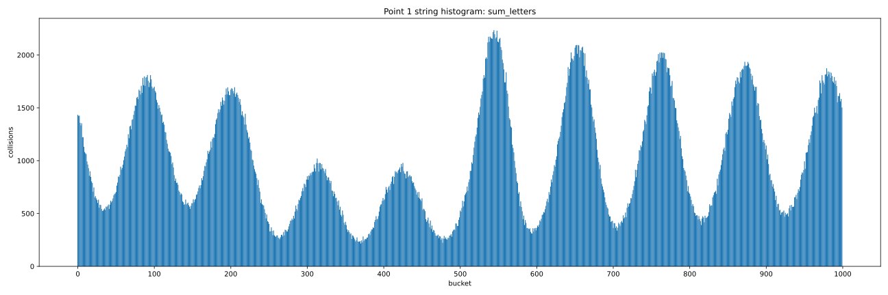

**Полиномиальный хеш**
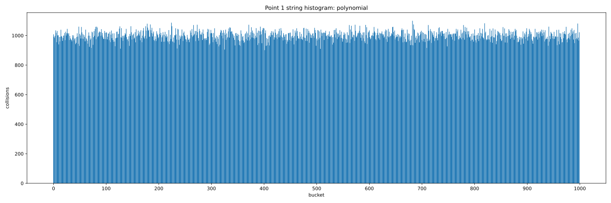

**CRC32**
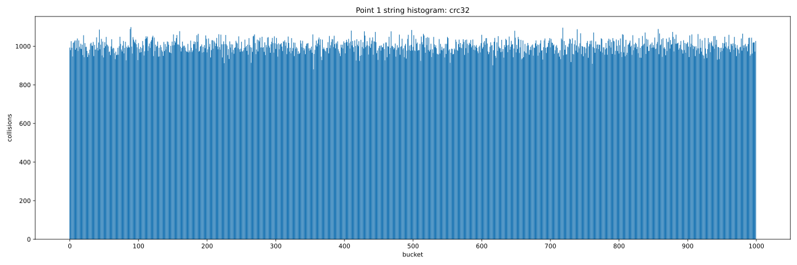

### Ответы на вопросы

#### Целые числа (`unsigned int`)

| Функция | Время, с | Дисперсия | Минимум | Максимум |
|---|---:|---:|---:|---:|
| `remainder` | 0.001503892 | 913.384 | 899 | 1102 |
| `bit_repr` | 0.001806860 | 1021.410 | 905 | 1096 |
| `knuth_mult` | 0.001481628 | 1080.186 | 898 | 1097 |

По графикам видно, что все три функции работают хорошо: распределение близко к равномерному, а различия по времени минимальны.

- **Остаток от деления** - наименьшая дисперсия на этих данных.
- **Битовое представление** - хорошее распределение.
- **Метод Кнута** - наименьшее время, но по дисперсии немного хуже.

**Вывод:** для случайных равномерных `unsigned int` все три функции подходят хорошо. На этих тестах даже очень простая функция - с хорошим результатом.

#### Числа с плавающей точкой (`float`)

| Функция | Время, с | Дисперсия | Минимум | Максимум |
|---|---:|---:|---:|---:|
| `cast_int_bits` | 0.001814285 | 53984578.770 | 0 | 99838 |
| `bit_repr` | 0.001509747 | 1272849.412 | 150 | 3910 |
| `mantissa` | 0.001506496 | 1288383.054 | 142 | 3990 |
| `exponent` | 0.001605751 | 252009532.856 | 0 | 399169 |
| `mantissa_x_exponent` | 0.001911900 | 4555147.314 | 65 | 24316 |

Для `float` результаты заметно хуже, чем для целых чисел.

- **Преобразование к `int`** - очень большое число коллизий, причина в потере дробной части.
- **Битовое представление** - один из лучших результатов.
- **Мантисса** - результат, близкий к полному битовому представлению.
- **Экспонента** - очень плохое распределение, так как в диапазоне `[-10, 10]` принимает мало значений.
- **Мантисса × экспонента** - лучше, чем одна экспонента, но хуже полного битового представления.

**Стоит ли хешировать `float`?**  
Да, но осторожно. Лучше использовать полное битовое представление или предварительную нормализацию. Простые варианты вроде приведения к `int` - плохой выбор.

#### Строки

| Функция | Время, с | Дисперсия | Минимум | Максимум |
|---|---:|---:|---:|---:|
| `length` | 0.003412297 | 61501011.506 | 0 | 62968 |
| `sum_letters` | 0.015021714 | 289399.108 | 216 | 2235 |
| `polynomial` | 0.014728349 | 983.126 | 901 | 1100 |
| `crc32` | 0.017269159 | 1031.864 | 880 | 1099 |

- **Длина строки** - очень плохой результат, слишком мало информации о ключе.
- **Сумма букв** - лучше, но порядок символов не учитывается.
- **Полиномиальный хеш** - почти идеальное распределение.
- **CRC32** - тоже очень хорошее распределение, но время немного больше.

**Вывод:** для строк хорошие результаты - только у функций, учитывающих порядок символов. В этой работе лучший вариант - **полиномиальный хеш**, `CRC32` - тоже очень хороший.

## Пункт 2. Сравнение хеш-таблиц

### Проделанная работа

Реализованы хеш-таблицы для `int`:
- цепочки;
- линейное пробирование;
- квадратичное пробирование;
- двойное хеширование;
- кукушка.

Проведены тесты:
1. зависимость времени вставки `1 000 000` элементов от `load factor`;
2. случайные операции вставки, поиска и удаления с равными вероятностями;
3. те же операции при вероятностях `0.5 / 0.25 / 0.25`.

**Зависимость времени вставки от `load factor`**
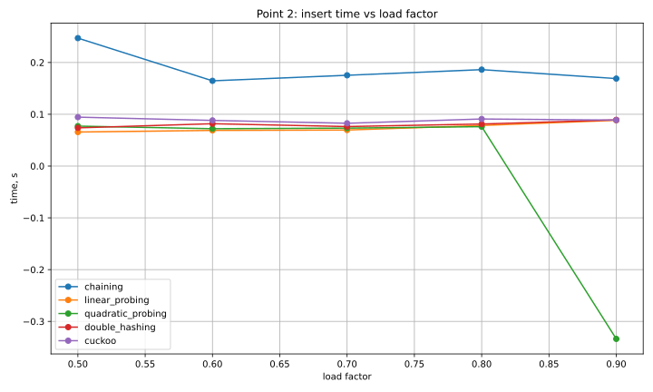

**Случайные операции: равные вероятности**
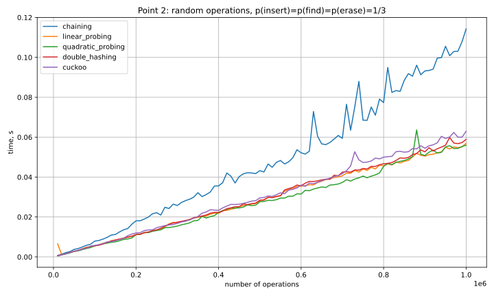

**Случайные операции: вставок больше**
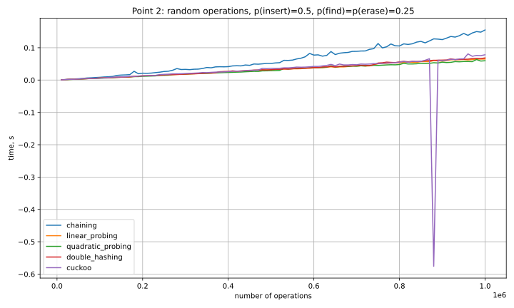

### Ответы на вопросы

#### Зависимость времени от `load factor`

По графику видно:
- **цепочки** - медленнее остальных;
- методы открытой адресации - в среднем быстрее;
- среди них **двойное хеширование** - самый устойчивый вариант;
- при больших `load factor` - заметная деградация открытой адресации.

#### Случайные операции при равных вероятностях

По графику видно:
- **цепочки** - снова самый медленный вариант;
- открытая адресация - лучшие результаты;
- **двойное хеширование** - наиболее ровное и стабильное поведение;
- **кукушка** - быстро, но возможны скачки из-за вытеснений и перестроек.

#### Случайные операции при `insert = 0.5`

Когда вставок больше, различия между методами становятся заметнее:
- **цепочки** - снова хуже по скорости;
- **линейное**, **квадратичное** и **двойное хеширование** - близкие результаты;
- **двойное хеширование** - лучший компромисс;
- **кукушка** - возможны резкие скачки времени из-за перестройки.

#### Какой `load factor` лучше выбрать

Разумные значения:
- **цепочки**: около `1.0`;
- **линейное пробирование**: около `0.7`;
- **квадратичное пробирование**: около `0.5 - 0.6`;
- **двойное хеширование**: около `0.7`;
- **кукушка**: около `0.45 - 0.5`.

#### Итог по пункту 2

Лучший метод открытого хеширования в этой работе - **двойное хеширование**.  
Причина - хороший баланс между скоростью, устойчивостью и качеством работы при росте заполненности таблицы.

## Пункт 3. Сравнение идеального хеширования с обычным

### Проделанная работа

Построены четыре таблицы на наборе из `100000` различных чисел:
- цепочки;
- двойное хеширование;
- кукушка;
- идеальное хеширование.

Для каждой таблицы выполнено `10 000 000` запросов поиска.  
Измерялось время построения и время поиска.

**Время построения**
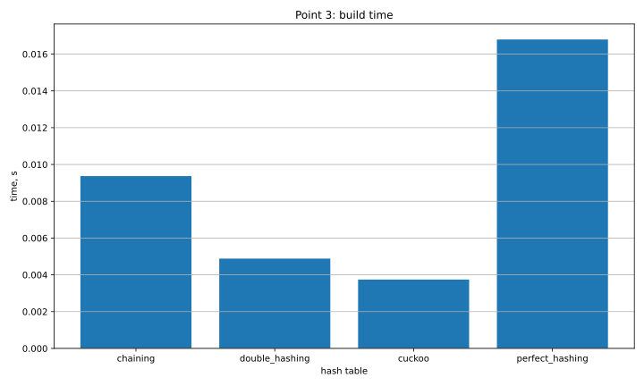

**Время поиска**
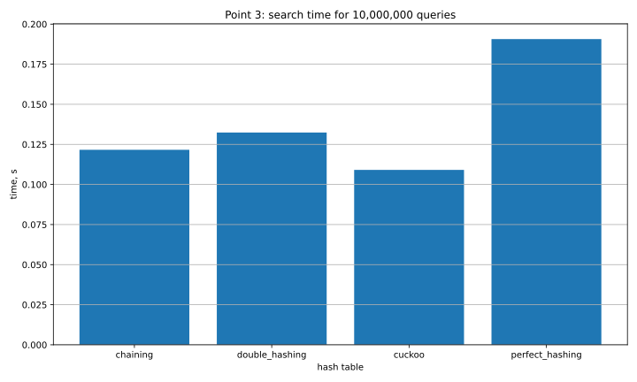

### Ответы на вопросы

#### Что видно по времени построения

По графику:
- **кукушка** - наименьшее время построения;
- **двойное хеширование** - следующий результат;
- **цепочки** - далее;
- **идеальное хеширование** - самое большое время построения.

Это ожидаемо: идеальное хеширование требует более сложного построения.

#### Что видно по времени поиска

По графику:
- **кукушка** - самый быстрый поиск;
- **цепочки** - следующий результат;
- **двойное хеширование** - далее;
- **идеальное хеширование** - самое большое время поиска.

Для данной реализации идеальное хеширование - без преимущества по времени поиска.

#### Есть ли смысл в идеальном хешировании

Смысл есть только в специальных задачах:
- когда множество ключей фиксировано;
- когда после построения нужно выполнять очень много поисков;
- когда можно позволить себе дорогое построение.

В этой работе идеальное хеширование - самый дорогой вариант по построению и без выигрыша по поиску, поэтому практической пользы именно на этих тестах нет.

#### Итог по пункту 3

На данных этой работы:
- **кукушка** - лучший результат;
- **двойное хеширование** - хороший компромисс;
- **идеальное хеширование** - без ожидаемого практического преимущества.

## Пункт 4. Вывод

### Проделанная работа

Были исследованы хеш-функции, сравнены хеш-таблицы, обычное и идеальное хеширование.


### Общие выводы

1. **Качество хеш-функции сильно зависит от типа данных.**
   Для целых чисел даже простые функции могут работать хорошо, а для `float` и строк неудачный выбор приводит к большому числу коллизий.

2. **Для строк лучшими оказались функции, учитывающие порядок символов.**
   В этой работе это **полиномиальный хеш** и **CRC32**.

3. **Для `float` плохими вариантами оказались приведение к `int` и использование только экспоненты.**
   Лучше работают полное битовое представление и мантисса.

4. **Среди хеш-таблиц лучшим методом открытого хеширования оказалось двойное хеширование.**
   Оно показало наиболее стабильное и сбалансированное поведение.

5. **Хеширование кукушки** дало очень быстрый поиск, но вставки у него менее стабильны.

6. **Идеальное хеширование** в этой работе не дало практического преимущества:
   оно строилось дольше и не стало лучшим по времени поиска.

### Итог

- для строк лучший - **полиномиальный хеш**;
- для динамических таблиц - **двойное хеширование**;
- для очень быстрого поиска хорошо показала себя **кукушка**.

Универсально лучшего решения нет: выбор зависит от типа данных и характера операций.

## Пункт 5. Запуск

```bash
./scripts/run_all.sh