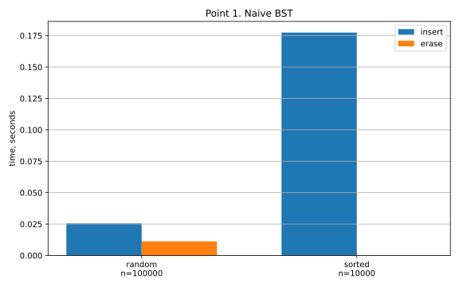
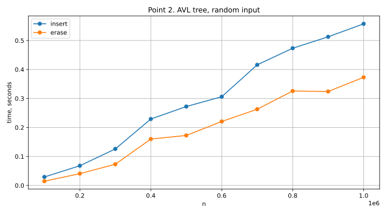
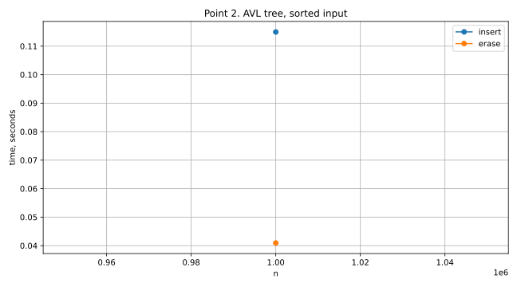
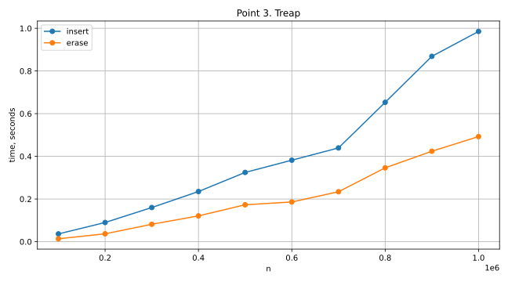
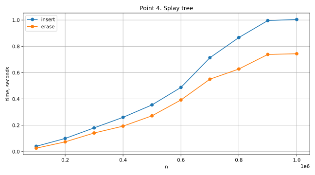
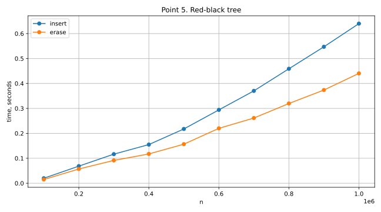
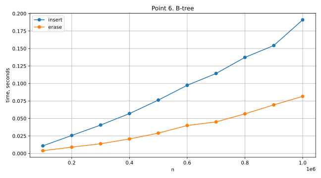
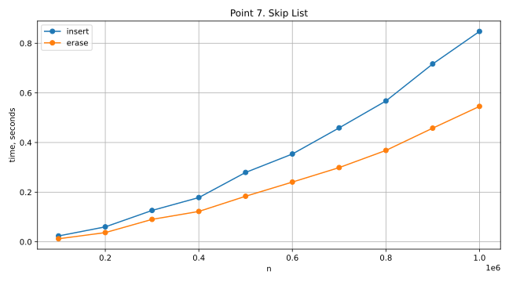

# Лабораторная работа 5. Деревья

## Пункт 1. Наивное дерево поиска

### Проделанная работа

В этом пункте было написано обычное бинарное дерево поиска без балансировки.

Для него были сделаны два набора тестов:

* вставка `100000` случайных элементов;
* удаление `50000` элементов из уже построенного дерева;
* такой же тест для отсортированной последовательности длины `10000`.

Каждый тест запускался 5 раз, после чего бралось среднее время. Вставка и удаление измерялись отдельно.

### График



### Комментарий

На случайных данных наивное дерево обычно работает нормально, потому что дерево получается не совсем вырожденным. Но гарантий у него нет.

На отсортированной последовательности ситуация намного хуже: элементы вставляются один за другим в одну сторону, и дерево фактически превращается в список. Поэтому высота становится порядка `n`, а операции начинают работать не за `O(log n)`, а за `O(n)`.

Из-за этого отсортированный тест сделан меньшего размера: для наивного дерева последовательность вставок в таком случае имеет оценку `O(n^2)`.

---

## Пункт 2. AVL-дерево

### Проделанная работа

В этом пункте было реализовано AVL-дерево.

Тесты запускались для размеров:

`100000`, `200000`, ..., `1000000`.

Для каждого размера выполнялись:

* вставка `n` случайных элементов;
* удаление `n / 2` элементов из построенного дерева.

Каждый запуск повторялся 5 раз, в итоговый результат записывалось среднее значение.

Отдельно был сделан тест для отсортированной последовательности длины `1000000`.

### Графики





### Комментарий

AVL-дерево не вырождается даже на отсортированном вводе, потому что после вставок и удалений оно восстанавливает баланс поворотами. Для каждой вершины разность высот левого и правого поддерева не должна быть больше `1`.

За счет этого высота дерева остается `O(log n)`, и операции вставки, поиска и удаления тоже работают за `O(log n)`.

График для отсортированной последовательности выглядит необычно, потому что по условию там проверяется только один размер: `n = 1000000`. Поэтому это не полноценная зависимость от `n`, а просто отдельный замер для большого отсортированного входа.

---

## Пункт 3. Декартово дерево

### Проделанная работа

Было реализовано декартово дерево. В каждом узле хранится ключ и случайный приоритет.

Дерево одновременно поддерживает два свойства:

* по ключам это бинарное дерево поиска;
* по приоритетам это куча.

Основные операции сделаны через `split` и `merge`:

* `split` делит дерево по ключу;
* `merge` объединяет два дерева, если все ключи первого меньше ключей второго.

Тесты проводились для размеров от `100000` до `1000000` с шагом `100000`. Для каждого размера измерялись вставка `n` элементов и удаление `n / 2` элементов. Результат усреднялся по 5 запускам.

### График



### Комментарий

Декартово дерево балансируется за счет случайных приоритетов. В отличие от AVL-дерева, здесь не нужно хранить высоты и делать балансировку по разности высот.

Из-за случайных приоритетов форма дерева может немного отличаться от запуска к запуску. Поэтому небольшие колебания времени на графике для этой структуры нормальны.

В среднем высота декартова дерева получается `O(log n)`, поэтому основные операции тоже имеют среднее время `O(log n)`.

---

## Пункт 4. Splay-дерево

### Проделанная работа

В этом пункте было реализовано Splay-дерево.

Главная идея этой структуры: после обращения к узлу он поднимается в корень с помощью операции `splay`.

В реализации используются стандартные случаи:

* `zig`;
* `zig-zig`;
* `zig-zag`.

Тесты запускались для размеров от `100000` до `1000000` с шагом `100000`. Для каждого размера отдельно измерялись вставки и удаления. Каждый результат усреднялся по 5 запускам.

### График



### Комментарий

Splay-дерево не хранит высоту, цвет или баланс-фактор. Оно перестраивает себя во время операций.

Одна отдельная операция в плохом случае может быть дорогой, но для последовательности операций получается амортизированная оценка `O(log n)`.

Такое дерево может быть полезно, если некоторые ключи используются часто: недавно использованные элементы оказываются ближе к корню.

---

## Пункт 5. Красно-черное дерево

### Проделанная работа

Было реализовано красно-черное дерево.

В каждом узле хранится цвет: красный или черный. Вставка и удаление сначала выполняются почти как в обычном BST, а затем дерево исправляется перекрашиваниями и поворотами.

Тесты проводились для размеров от `100000` до `1000000` с шагом `100000`. Для каждого размера выполнялись вставка `n` случайных элементов и удаление `n / 2` элементов. Время усреднялось по 5 запускам.

### График



### Комментарий

Красно-черное дерево поддерживает баланс не так строго, как AVL-дерево, но этого достаточно, чтобы высота оставалась логарифмической.

Главное отличие от AVL в том, что AVL сильнее ограничивает высоту дерева, а красно-черное дерево обычно тратит меньше действий на восстановление после изменений. Поэтому красно-черные деревья часто используют в стандартных библиотеках.

---

## Пункт 6. B-дерево

### Проделанная работа

В этом пункте было реализовано B-дерево.

В отличие от обычных бинарных деревьев, один узел B-дерева хранит сразу несколько ключей и несколько указателей на детей.

При вставке, если узел переполняется, он делится на два узла, а средний ключ поднимается выше. При удалении поддерживается минимальное количество ключей в узлах: если ключей становится слишком мало, используется заимствование у соседа или слияние узлов.

Тесты проводились для размеров от `100000` до `1000000` с шагом `100000`. Для каждого размера измерялась вставка `n` элементов и удаление `n / 2` элементов. Результаты усреднялись по 5 запускам.

### График



### Комментарий

B-дерево имеет маленькую высоту, потому что в одном узле хранится не один ключ, а несколько. Из-за этого ветвление намного больше, чем у бинарных деревьев.

Такая структура хорошо подходит для внешней памяти и лучше работает с кешами: за один переход по указателю обрабатывается сразу несколько ключей.

---

## Пункт 7. Skip List

### Проделанная работа

Был реализован Skip List.

Это несколько уровней отсортированных связных списков. Нижний уровень содержит все элементы, а верхние уровни позволяют быстрее перескакивать через большие участки списка.

При вставке уровень нового элемента выбирается случайно. При удалении элемент удаляется со всех уровней, на которых он есть.

Тесты запускались для размеров от `100000` до `1000000` с шагом `100000`. Для каждого размера измерялись вставки `n` элементов и удаления `n / 2` элементов. Итоговое время усреднялось по 5 запускам.

### График



### Комментарий

Skip List похож по асимптотике на сбалансированные деревья поиска. В среднем поиск, вставка и удаление работают за `O(log n)`.

Но структура вероятностная, поэтому время может колебаться сильнее, чем у AVL или красно-черного дерева. Это зависит от того, как случайно распределились элементы по уровням.

---

## Пункт 8. Вывод

В этой работе были сравнены несколько структур данных для хранения упорядоченного множества.

Наивное дерево поиска оказалось самым простым по реализации, но у него есть серьезная проблема: оно никак не защищено от плохого порядка вставки. На отсортированных данных такое дерево вырождается в список, и операции становятся линейными.

AVL-дерево решает эту проблему за счет строгой балансировки. Оно стабильно работает за `O(log n)` даже на отсортированных данных. Минус в том, что после изменений нужно пересчитывать высоты и выполнять повороты.

Декартово дерево и Skip List используют рандомизацию. За счет этого они проще по идее балансировки, но их поведение немного зависит от случайных значений. В среднем обе структуры дают логарифмическое время операций.

Splay-дерево отличается от остальных тем, что не хранит явный баланс. Оно поднимает недавно использованные элементы к корню. Поэтому у него важна не стоимость одной операции, а амортизированная стоимость последовательности операций.

Красно-черное дерево поддерживает баланс мягче, чем AVL. Из-за этого оно может быть немного выше, но зато часто требует меньше поворотов при изменениях. Поэтому это хороший универсальный вариант для словарей и множеств.

B-дерево отличается от остальных структур тем, что один узел хранит несколько ключей. Благодаря этому дерево получается низким. Такая идея особенно полезна, когда важно уменьшить число переходов между узлами, например при работе с внешней памятью или кешами.

В итоге можно сказать так: если нужна простая демонстрация BST, подойдет наивное дерево, но на практике без балансировки оно ненадежно. Для стабильных гарантий лучше использовать AVL или красно-черное дерево. Если подходит вероятностный подход, удобны декартово дерево и Skip List. Для больших объемов данных и уменьшения высоты дерева хорошо подходит B-дерево.

---

## Запуск

```bash
cd lab5
chmod +x scripts/*.sh
make clean
make all
export PYTHONPATH="$PWD"
./scripts/run_all.sh

